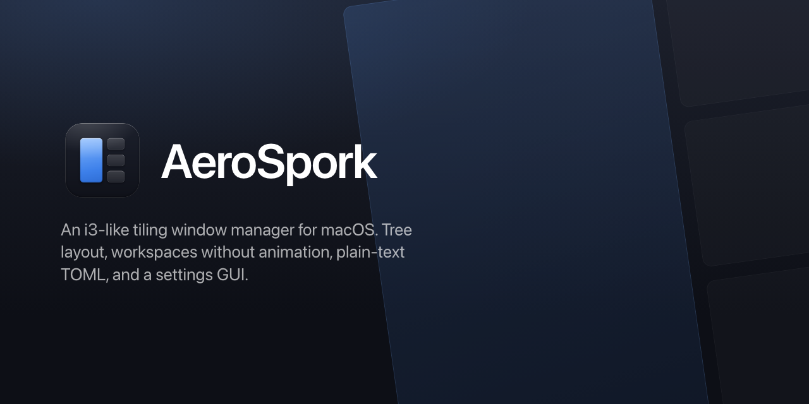
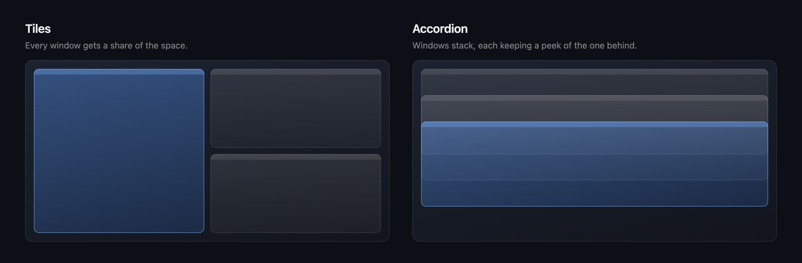

<div align="center">



<p>
  <a href="https://github.com/wbsmolen/aerospork/actions/workflows/ci.yml"></a>
  
  
  <a href="legal/LICENSE.txt"></a>
</p>

</div>

AeroSpork tiles your windows in a tree, the way i3 does, with virtual workspaces that switch
instantly and no need to disable System Integrity Protection. It is configured in TOML, driven from
the command line, and, unlike most tiling managers, ships a settings GUI for the parts you would
rather click than memorize.

AeroSpork is a fork of [AeroSpace](https://github.com/nikitabobko/AeroSpace) by Nikita Bobko, which
is where the tree layout model, the workspace emulation and most of the command surface come from.
Both are MIT licensed; see [`legal/`](legal/) for the full notice and attribution.

<div align="center">
  
</div>

---

## Features

- **Tree-based tiling:** windows are leaves; containers have an orientation and a layout
- **Instant workspace switching:** virtual workspaces, no Spaces animation, no SIP changes
- **Settings GUI:** seven tabs; opening it and changing nothing leaves your config byte-identical
- **Plain-text TOML config:** dotfiles friendly, hot-reloaded on save
- **CLI first:** 36 commands, man pages, shell completion for bash/fish/zsh
- **Multi-monitor by hardware identity:** UUID and EDID, including DisplayLink docks
- **One dependency:** sockets, hotkeys and volume all use platform APIs

---

## What's Different from AeroSpace

The fork exists for two reasons: multi-monitor identity that holds up over USB docks, and a
configuration experience that does not require memorizing a schema.

The tree layout, virtual workspaces, SIP-free operation, TOML config and the CLI are inherited and
behave the same in both. Only the differences are listed here:

| | AeroSpace | AeroSpork |
|---|:---:|:---:|
| Monitor matching by hardware UUID / EDID | ❌ &nbsp;name, regex or index only | ✅ |
| Pin a workspace to a specific DisplayLink panel | ❌ | ✅ |
| Settings GUI | ❌ &nbsp;"No GUI configuration" | ✅ &nbsp;7 tabs |
| Signed, notarized & stapled builds | ❌ &nbsp;"Not notarized" | ✅ |
| Third-party dependencies | 4 | **1** |
| Config schema | one syntax | v2 shorthand, older syntax still parses |
| Command surface | **larger** | smaller |
| Maturity | **public beta, larger community** | younger fork |

<sub>Upstream columns verified against
<a href="https://github.com/nikitabobko/AeroSpace">nikitabobko/AeroSpace</a> <code>main</code>. Its README
lists "No GUI configuration" and "Not notarized" as known limitations, its <code>Package.swift</code>
declares 4 dependencies, and its guide documents monitor patterns as main/secondary/index/regex only.</sub>

Feature parity is explicitly not a goal; the last two rows are the trade. If you want the most
complete and most battle-tested macOS tiling manager, use AeroSpace.

**Monitors are identified by hardware, not by name.** Upstream matches a display by name, regex or
position. AeroSpork adds a real fingerprint: vendor / model / serial, plus the stable per-display
UUID from `CGDisplayCreateUUIDFromDisplayID`. That matters most for DisplayLink docks: a DisplayLink
panel reports no EDID at all, so the UUID is the *only* key that can tell two identical ones apart.
Upstream's EDID path also read `IOServiceMatching("IODisplayConnect")`, an IOKit class that does not
exist on Apple Silicon, so vendor/model/serial came back `nil` for every display; AeroSpork reads
them from CoreGraphics instead.

**A configuration schema you can hold in your head.** `mod` plus `workspaces` generates the usual
i3 keymap instead of making you write sixty lines of it, and `[keys]`, `[monitors]` and
`[on-window]` replace the longer upstream spellings. An existing config is migrated automatically on
first launch, and only if the migration is *proven* to parse to the same effective configuration,
otherwise your file is left alone. The original is kept beside it as `*.pre-v2`. The older syntax
still parses, so nothing forces you to move.

**A settings GUI.** Upstream is config-file-only. AeroSpork has seven tabs: General, Gaps, Keys,
Monitors, Events, Window Rules, and a raw TOML editor validated against the same parser the app uses
at startup. It writes through a comment-preserving editor that only rewrites the keys you actually
changed, so opening Settings and changing nothing leaves your file byte-identical.

**One third-party dependency.** Only TOMLKit remains. Unix-socket IPC is POSIX `AF_UNIX`, global
hotkeys are Carbon `RegisterEventHotKey`, and volume is CoreAudio, replacing BlueSocket, HotKey and
ISSoundAdditions. The ANTLR-generated shell language is gone; `exec-and-forget` hands the string to
`/bin/bash -c`.

**Signed, notarized releases.** Universal (arm64 + x86_64) builds, signed with a Developer ID,
notarized and stapled, with a Homebrew cask generated from the result.

Smaller things: workspaces are created on demand and released when they empty, rather than being
materialized for every name a keybinding mentions; redundant Accessibility frame writes are skipped,
which matters on a DisplayLink link where every write is a framebuffer repaint; and the test suite
is fully headless, so it runs without windows or Accessibility permission.

### Coming from AeroSpace

This is a fork, not a drop-in replacement. Configs and scripts need small edits:

- **`AEROSPACE_*` environment variables are gone**, not aliased. A script reading
  `$AEROSPACE_FOCUSED_WORKSPACE` now sees an empty string with no error anywhere. The names are
  `AEROSPORK_FOCUSED_WORKSPACE`, `AEROSPORK_PREV_WORKSPACE`, `AEROSPORK_WINDOW_ID` and
  `AEROSPORK_WORKSPACE`.
- **`if.during-aerospace-startup` is a hard error**, spelled `if.during-aerospork-startup` here.
  Unknown keys are fatal, so this one fails loudly and names the line.
- **Feature parity is a non-goal.** The fork deliberately carries less surface area than upstream.

Everything else behaves as you expect: the tree model, the commands, the layout semantics.

---

## Installation

Download the notarized build from the
[releases page](https://github.com/wbsmolen/aerospork/releases), move `aerospork.app` to
`/Applications`, and grant Accessibility permission when prompted.

A Homebrew cask is published at [`wbsmolen/tap`](https://github.com/wbsmolen/homebrew-tap):

```bash
brew install --cask wbsmolen/tap/aerospork
```

Both repositories are private during early release, so `brew install` currently works only for
accounts with access; the release zip works for anyone.

### Build from Source

```bash
./build-debug.sh            # debug build into .debug/ (uses ~/.aerospork-debug.toml)
./build-release.sh          # signed release; needs an Apple Development certificate
```

### Requirements

- macOS 13.0 (Ventura) or later
- Xcode 26 or newer (CI builds on Swift 6.3; `Package.swift` targets the 6.0 language mode)
- Accessibility permission

---

## Quick Start

### Configuration

AeroSpork reads whichever one of these exists; having both is an error it reports at startup:

- `~/.aerospork.toml`
- `${XDG_CONFIG_HOME}/aerospork/aerospork.toml` (`XDG_CONFIG_HOME` defaults to `~/.config`)

With no config file at all, the app falls back to a complete default that ships inside the bundle,
so a fresh install already has a working i3-style keymap. The same file is
[`docs/config-examples/default-config.toml`](docs/config-examples/default-config.toml). Copy it and
edit. Saved changes hot-reload; there is no reload command to remember.

A minimal config in full:

```toml
mod = "alt"                 # generates the i3 keymap: alt-h/j/k/l, alt-shift-h/j/k/l, ...
workspaces = "1-9"          # alt-1..9 to switch, alt-shift-1..9 to move a window

[gaps]
inner = 8
outer = 8

[keys]                      # anything here overrides a generated binding
alt-enter = "exec-and-forget open -na Ghostty"

[monitors]                  # pin a workspace to a screen
1 = "main"
2 = { uuid = "AAAAAAAA-0000-4000-8000-000000000001" }

[on-window]                 # where a window goes when it appears
"com.apple.mail" = "move-node-to-workspace 3"
```

`uuid` is worth preferring over a name: it is the only key that distinguishes two monitors of the
same model, and the only one a DisplayLink panel has. Run
`aerospork list-monitors --format '%{monitor-fingerprint}'` to see what to paste.

### Settings GUI

Open it from the menu bar icon, press **⌘,** while AeroSpork is frontmost, or run
`aerospork open-settings`, which is also allowed in config, so you can bind it to a key.

| Tab | What it edits |
|---|---|
| **General** | start at login, dock/menu-bar icons, default layout and orientation, normalization, key-mapping preset |
| **Gaps** | inner and outer gaps |
| **Keys** | bindings per mode, with a key recorder: press the shortcut instead of typing its notation |
| **Monitors** | connected displays with copyable UUIDs, and workspace-to-monitor pinning |
| **Events** | `after-startup-command`, the focus-change callbacks, and the `[exec]` environment |
| **Window Rules** | placement rules for windows as they appear |
| **Raw TOML** | the whole file, validated live against the real parser |

Structured tabs apply live on a short debounce, as macOS settings normally do; the Raw TOML tab has
an explicit **Apply**, because half-typed TOML is invalid most of the time.

> **Your config is safe to open in the GUI.** Opening Settings and changing nothing leaves the file
> byte-identical, and editing one section never rewrites another, so comments, per-monitor gaps and
> hardware fingerprints the GUI cannot model survive untouched. Where a construct cannot be
> represented, the editor refuses the change and points you at the Raw TOML tab rather than
> degrading it.

### CLI

```bash
aerospork focus left                        # focus the window to the left
aerospork workspace 1                       # switch to workspace 1
aerospork move-node-to-workspace 2          # move the focused window
aerospork layout tiles horizontal vertical  # cycle layout
aerospork list-monitors                     # what displays are connected, and how they are identified
aerospork --help                            # all 36 commands
```

---

## Architecture

**Tree layout.** Workspaces are roots, containers carry an orientation (horizontal/vertical) and a
layout (tiles/accordion), and windows are leaves.

**Virtual workspaces.** AeroSpork emulates workspaces by showing and hiding windows rather than
using native macOS Spaces, which is what makes switching instant and avoids requiring SIP to be
disabled.

**Monitor identity.** A display is matched on, in order of reliability: the per-display UUID, then
EDID vendor/model/serial from CoreGraphics, then the localized name, then size. DisplayLink panels
expose no EDID, so UUID is the only thing that pins a workspace to a specific one. Screen
reconfiguration is debounced, because a DisplayLink dock connects in several stages.

**Client/server.** The app runs a Unix-socket server; the `aerospork` binary is a thin client.
Framing is length-prefixed with a size cap, over POSIX `AF_UNIX`. No socket library.

```
Sources/
├── aerosporkApp/    # app entry point
├── AppBundle/       # the window manager
│   ├── tree/        # workspaces, containers, windows
│   ├── layout/      # layout calculation
│   ├── command/     # command implementations
│   ├── config/      # parsing, migration, writing, hot-reload
│   ├── model/       # monitors and fingerprinting
│   ├── mouse/       # move/resize with the mouse
│   └── ui/          # settings GUI and menu bar (SwiftUI)
├── Cli/             # command-line client
├── Common/          # shared code, incl. the socket implementation
└── PrivateApi/      # C shim for _AXUIElementGetWindow
```

---

## Development

```bash
./build-debug.sh     # debug build (SwiftPM only, no Xcode)
./run-tests.sh       # tests, format and lint
./format.sh          # swiftformat + swiftlint
./build-docs.sh      # man pages and the docs site
```

The test suite is headless — a fake window tree and a mocked Accessibility layer — so it needs no
real windows and no Accessibility permission.

### Design system

[`.claude/skills/aerospork-design/`](.claude/skills/aerospork-design/) holds the design system:
tokens, the component set, three click-through UI kits (settings window, menu bar, CLI), specimen
cards and the brand artwork. It is derived from `Sources/AppBundle/ui/`, so it documents the
shipping interface rather than proposing a different one.

Read it before adding a settings surface. Two rules matter most, and
`UIChromeConsistencyTest` enforces them: shared controls live in
[`SettingsChrome.swift`](Sources/AppBundle/ui/SettingsChrome.swift) and a tab never grows its own
copy, and status symbols come from `StatusLabel.Kind` rather than string literals.

The UI kits are static HTML. Serve them rather than opening `file://`, which blocks the script
loading they depend on:

```bash
python3 -m http.server -d .claude/skills/aerospork-design 8000
```

See [`dev-docs/`](dev-docs/) for architecture notes, the contributor setup including code signing,
the testing strategy, and performance measurement guidance. `CLAUDE.md` covers repository
conventions.

---

## Troubleshooting

```bash
aerospork config --config-path      # which config file is actually loaded
aerospork reload-config --dry-run   # parse without applying, and say why not
aerospork --version                 # client and server versions; a mismatch is its own bug
```

If `--config-path` points inside the `.app` bundle, your config failed to load and AeroSpork is
running built-in defaults. The menu bar and the Settings window both say so explicitly.

AeroSpork logs to the macOS unified log. No log files, nothing to enable:

```bash
log show --last 1h --predicate 'subsystem == "com.wbs.aerospork"' --style compact
```

Use `com.wbs.aerospork.debug` for a debug build, and add `AND category == "config"` to narrow it.
For a verbose per-refresh trace set `AEROSPORK_DEBUG_LOG=1`; see *Troubleshooting and bug reports*
in [the guide](docs/guide.adoc) for the full recipe and what to attach to a report.

---

## License

MIT. AeroSpork is a fork of [AeroSpace](https://github.com/nikitabobko/AeroSpace), also MIT; the
original copyright is retained alongside the fork's in [`legal/LICENSE.txt`](legal/LICENSE.txt).

## Status

Active development. Features and configuration may still change.
